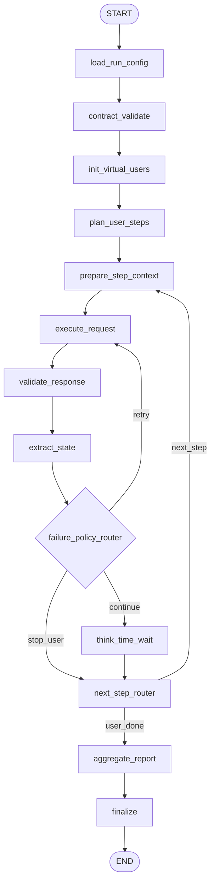

# LangGraph Testing Workflow Sample (Doctor Signup-Centric)

This is a design-level sample of the LangGraph workflow for our API testing engine.
It uses the doctor signup API as the first concrete journey step.

## 1) Graph Nodes (Agent Responsibilities)

1. `load_run_config`
- Load suite file, env defaults, runtime options.

2. `contract_validate`
- Validate endpoint contract completeness.
- Fail fast if required contract fields are missing.

3. `init_virtual_users`
- Create isolated user contexts.
- Seed RNG per user for deterministic random data.

4. `plan_user_steps`
- Expand configured workflow steps for each virtual user.

5. `prepare_step_context`
- Resolve placeholders from user/shared/built-in context.

6. `execute_request`
- Send API request (timeout/retry policy).

7. `validate_response`
- Assert status/latency/body/json-path/schema checks.

8. `extract_state`
- Save extractable fields (`doctor_id`, `access_token`, etc.).

9. `failure_policy_router`
- Decide retry / continue / stop based on policy.

10. `think_time_wait`
- Optional human-like delay between steps.

11. `next_step_router`
- Move to next step, next iteration, or finalize user.

12. `aggregate_report`
- Merge all user timelines and final run summary.

13. `finalize`
- Write console + JSON (+ optional markdown) report.

## 2) Sample Graph (Mermaid)



## 3) Signup Step Through This Graph

1. `prepare_step_context`
- Build signup payload with unique values:
  - `email`: `doctor+{run_id}_{user_index}_{rand}@example.com`
  - `mobileNumber`: randomized unique value

2. `execute_request`
- `POST /dc/api-auth/v1/auth/doctor/signUp`
- Header: `ACIN-API-KEY`

3. `validate_response`
- Check status (contract-defined)
- Check `success == true`

4. `extract_state`
- Save:
  - `doctor_id <- data.id`
  - `access_token <- data.token`
  - `refresh_token <- data.refreshToken`

5. `next_step_router`
- Move to next journey step (login/post/feed...) or finish.

## 4) Minimal State Shape

```json
{
  "run": {
    "run_id": "20260404_001",
    "virtual_users": 5,
    "iterations_per_user": 1,
    "default_timeout_seconds": 15,
    "default_retries": 1,
    "think_time_ms": [200, 1200]
  },
  "users": [
    {
      "user_index": 1,
      "iteration": 1,
      "context": {},
      "current_step_index": 0,
      "results": []
    }
  ],
  "contract": {},
  "report": {}
}
```

## 5) Routing Rules (Initial)

1. Retry only for timeout/network/5xx/explicit transient conditions.
2. Do not retry validation errors (4xx contract violations).
3. Continue-on-failure is workflow-configurable.
4. Redact sensitive values before storing traces/reports.

## 6) MCP + Framework Adapter Hook Points

1. Before `contract_validate`:
- Fetch contracts/datasets via MCP if configured.

2. Inside `execute_request`:
- Route through selected adapter:
  - `langgraph_native` (default)
  - `pytest` / `newman` / `k6` (future adapters)

3. Before `aggregate_report`:
- Push artifacts to MCP-backed store (optional).
